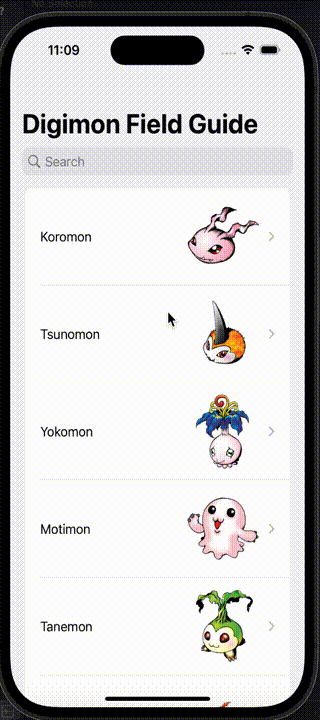

# Digimon Field Guide

This is a basic iOS SwiftUI MVVM Digimon Field Guide app that presents a list of Digimon and allows the user to tap each list cell to navigate to that Digimon's details. This app uses the data from the [Digimon API](https://digimon-api.vercel.app/api/digimon).

## Approach
* SwiftUI MVVM architecture pattern for simplicity
* Bundle extension with Generic functions to fetch and decode JSON data from server
    * Generics reduce any future code repetition
* Separate Constants file for global constants used repeatedly
* Protocal-Driven Development and dependency injection
    * DigimonService protocal and MockDigimonManager networking layer for unit testing the ViewModel
* Separate views DigimonListView, DigimonCellView, DigimonDetailsView, and ImageView for easier readability
* Unit Tests for Model and ViewModel

## User Stories

The following functionality is completed:

- [x] User can view a list of Digimon (names, image)
- [x] User can tap a list cell to showcase details (name, image, level)
- [x] User can search for Digimon by name

## Video Walkthrough

Here's a walkthrough of implemented user stories:

 

## License

    Copyright 2023 Asad Rizvi

    Licensed under the Apache License, Version 2.0 (the "License");
    you may not use this file except in compliance with the License.
    You may obtain a copy of the License at

        http://www.apache.org/licenses/LICENSE-2.0

    Unless required by applicable law or agreed to in writing, software
    distributed under the License is distributed on an "AS IS" BASIS,
    WITHOUT WARRANTIES OR CONDITIONS OF ANY KIND, either express or implied.
    See the License for the specific language governing permissions and
    limitations under the License.
